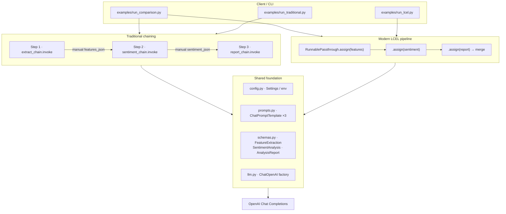
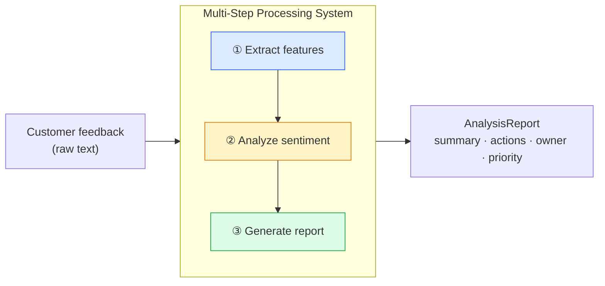
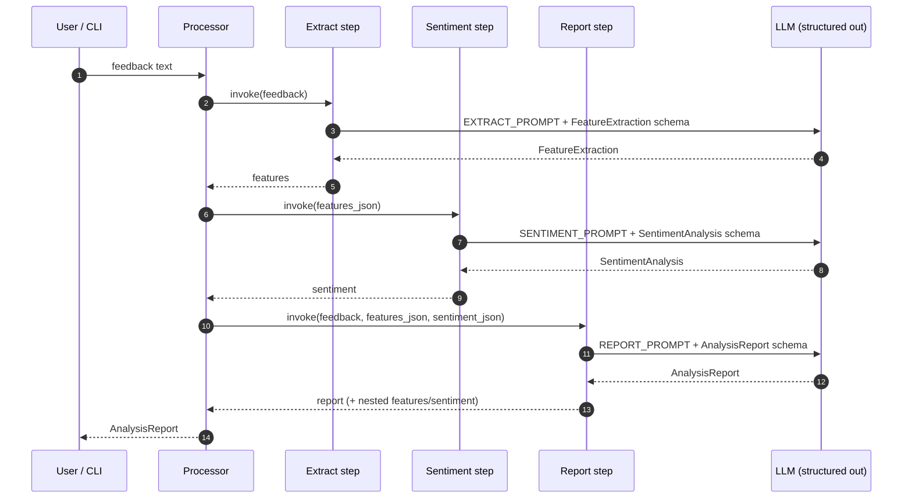
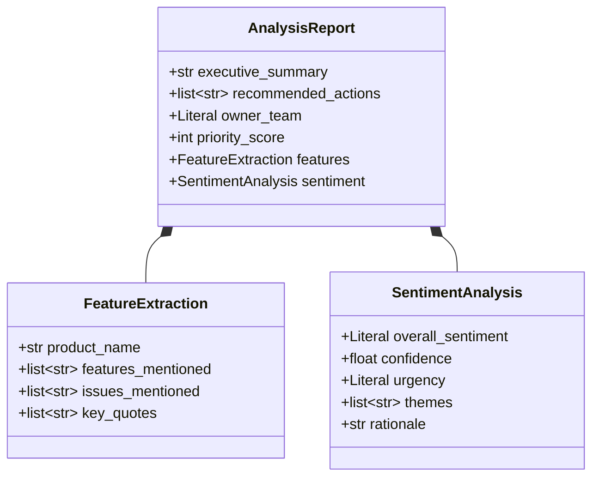
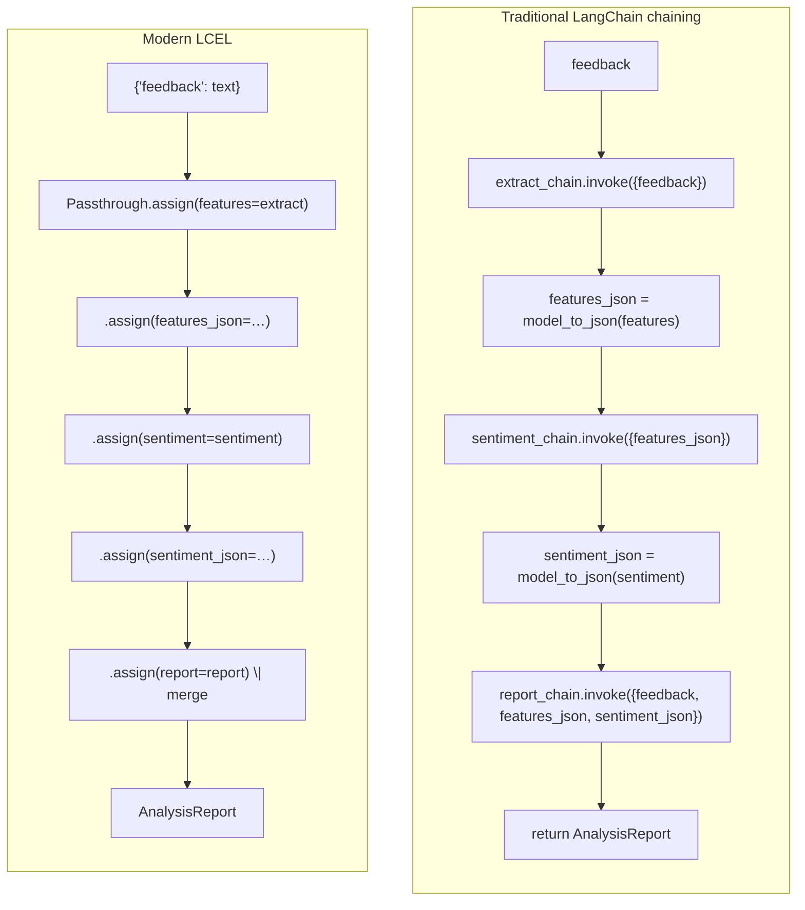
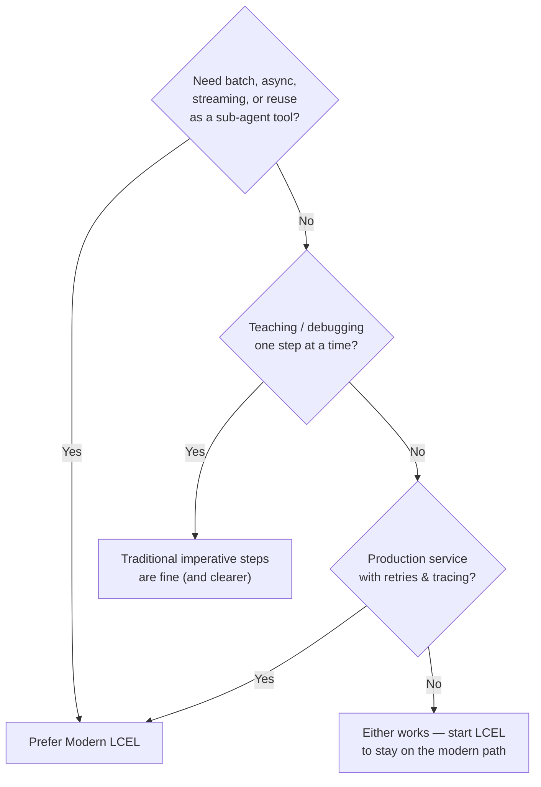
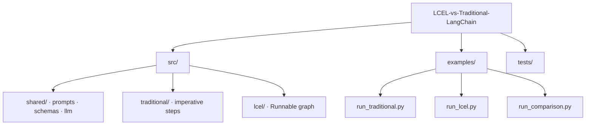

# LCEL vs Traditional LangChain

**Modern LCEL composition versus Traditional LangChain chaining** — a production-ready multi-step processing system that runs the *same* prompts and schemas through two orchestration styles so you can see the difference clearly.

| | Traditional chaining | Modern LCEL |
|---|---|---|
| Style | Imperative Python steps | Declarative `|` Runnable graph |
| Data flow | Manual dict hand-offs | `assign` / `RunnablePassthrough` |
| Async / batch / stream | Write it yourself | Built into every Runnable |
| Best for | Learning, step debugging | Production pipelines & agents |

---

## Table of contents

1. [Problem & approach](#problem--approach)
2. [System architecture](#system-architecture)
3. [Multi-step processing flow](#multi-step-processing-flow)
4. [Traditional vs LCEL (deep dive)](#traditional-vs-lcel-deep-dive)
5. [Project structure](#project-structure)
6. [Quick start](#quick-start)
7. [When to choose which](#when-to-choose-which)
8. [Testing](#testing)
9. [Production notes](#production-notes)

---

## Problem & approach

Customer feedback is messy. A useful internal signal usually needs **several LLM calls** in sequence:

1. **Extract** structured features from free text  
2. **Analyze** sentiment, urgency, and themes  
3. **Synthesize** an actionable report for the right owning team  

This repo implements that pipeline twice:

- **Traditional** — each step is invoked in Python; you wire outputs into the next input by hand  
- **LCEL** — the same steps are composed into one `Runnable` graph with the pipe operator  

Identical prompts (`src/shared/prompts.py`) and Pydantic schemas (`src/shared/schemas.py`) keep the comparison fair: only the **composition style** changes.

---

## System architecture

High-level layout of the multi-step processing system and how both styles sit on the same foundation.



### Component view



---

## Multi-step processing flow

Both implementations follow this logical pipeline. The **what** is identical; the **how it is wired** is not.



### Data contract



---

## Traditional vs LCEL (deep dive)

### Side-by-side composition



### Mental model

| Concern | Traditional | LCEL |
|---|---|---|
| Readability of control flow | Very clear (`step1` → `step2` → `step3` in Python) | Clear once you know `assign` / `|` |
| Boilerplate | High — serialize, pass keys, merge | Lower — graph carries state |
| Reuse as a sub-chain | Awkward (wrap in a function) | Natural (`pipeline` is a Runnable) |
| `.batch()` / `.ainvoke()` / streaming | Custom loops | One-liner on the composed graph |
| Retries / fallbacks | Per-step try/except | `with_retry`, `with_fallbacks` on nodes |
| Observability | Easy print-per-step | LangSmith traces the Runnable tree |
| Migration path | Legacy `LLMChain` / `SequentialChain` era | Current recommended LangChain style |

### Code shape (illustrative)

**Traditional — imperative hand-offs**

```python
features = self.extract_chain.invoke({"feedback": feedback})
features_json = model_to_json(features)

sentiment = self.sentiment_chain.invoke({"features_json": features_json})
sentiment_json = model_to_json(sentiment)

report = self.report_chain.invoke(
    {
        "feedback": feedback,
        "features_json": features_json,
        "sentiment_json": sentiment_json,
    }
)
```

**LCEL — declarative pipe graph**

```python
pipeline = (
    RunnablePassthrough.assign(features=extract)
    .assign(features_json=lambda x: model_to_json(x["features"]))
    .assign(sentiment=sentiment)          # reads features_json from state
    .assign(sentiment_json=lambda x: model_to_json(x["sentiment"]))
    .assign(report=report)                # reads feedback + json fields
    | RunnableLambda(merge_report)
)
```

### Decision guide



---

## Project structure

```text
LCEL-vs-Traditional-LangChain/
├── README.md
├── LICENSE
├── pyproject.toml
├── requirements.txt
├── .env.example
├── .gitignore
├── src/
│   ├── __init__.py
│   ├── config.py                 # Settings from env
│   ├── shared/
│   │   ├── prompts.py            # Identical prompts for both styles
│   │   ├── schemas.py            # Pydantic contracts
│   │   ├── llm.py                # ChatOpenAI factory + helpers
│   │   └── samples.py            # Demo feedback text
│   ├── traditional/
│   │   └── multi_step_chain.py   # Imperative multi-step processor
│   └── lcel/
│       └── multi_step_pipeline.py# Declarative LCEL Runnable graph
├── examples/
│   ├── run_traditional.py
│   ├── run_lcel.py
│   └── run_comparison.py         # Side-by-side CLI
└── tests/
    ├── test_schemas.py
    └── test_pipelines.py         # Mocked structural tests (no API key)
```



---

## Quick start

### 1. Create a virtualenv and install

```bash
cd LCEL-vs-Traditional-LangChain
python3 -m venv .venv          # Python 3.9+ (3.11/3.12 recommended)
source .venv/bin/activate
pip install -r requirements.txt
```

### 2. Configure secrets

```bash
cp .env.example .env
# edit .env and set OPENAI_API_KEY
```

### 3. Run either style

```bash
# Traditional imperative chaining
python examples/run_traditional.py

# Modern LCEL pipeline
python examples/run_lcel.py

# Side-by-side comparison (+ optional --json)
python examples/run_comparison.py
python examples/run_comparison.py --json
python examples/run_comparison.py -f "Search is slow and offline mode loses edits."
```

### 4. Use from code

```python
from src.traditional import build_traditional_processor
from src.lcel import build_lcel_processor

feedback = "Great sync, but version restore crashes every time."

trad_report, trad_steps = build_traditional_processor().process(feedback)
lcel_report, lcel_traces = build_lcel_processor().process(feedback)

# LCEL-only superpowers
import asyncio
report = asyncio.run(build_lcel_processor().aprocess(feedback))
batch = build_lcel_processor().batch([feedback, "UI is lovely but billing surprised us."])
```

---

## When to choose which

| Situation | Recommendation |
|---|---|
| Learning how multi-step LLM apps work | Start with **Traditional** — the control flow is obvious |
| Shipping a service, agent tool, or RAG stage | Prefer **LCEL** — batch/async/stream/retry come free |
| Need to plug this pipeline into a larger graph | **LCEL** — a `Runnable` composes cleanly |
| Heavy custom branching / human-in-the-loop | Either; for complex graphs consider **LangGraph** on top of LCEL |
| Migrating legacy `LLMChain` / `SequentialChain` | Rewrite toward **LCEL**; keep prompts & schemas |

> **Note:** This project intentionally uses modern `prompt | llm.with_structured_output(...)` building blocks in *both* paths. The Traditional folder demonstrates the **imperative chaining pattern**, not deprecated `LLMChain` APIs — so the comparison stays useful on current LangChain releases.

---

## Testing

Unit/structural tests mock the LLM so CI does not need an API key:

```bash
pytest -q
```

Live smoke (requires `OPENAI_API_KEY`):

```bash
python examples/run_comparison.py --json
```

---

## Production notes

- **Secrets** — load via `.env` / secret manager; never commit keys (see `.gitignore`).
- **Structured outputs** — Pydantic schemas give typed, validated step contracts.
- **Observability** — set `LANGCHAIN_TRACING_V2=true` and a LangSmith key to trace the LCEL graph node-by-node.
- **Resilience** — on LCEL nodes prefer `.with_retry(...)` / `.with_fallbacks(...)`; on Traditional wrap each `invoke` in your own retry policy (e.g. Tenacity).
- **Cost & latency** — three LLM calls per feedback item; batch with LCEL when processing queues.
- **Model config** — `OPENAI_MODEL` / `OPENAI_TEMPERATURE` in `.env` (defaults: `gpt-4o-mini`, `0.2`).

---

## License

MIT — see [LICENSE](LICENSE).
